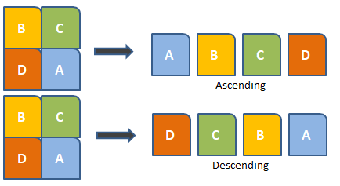

# Data Structures

  A data structure is a collection of data type ‘values’ which are stored and organized in such a way that it allows for efficient access and modification. In some cases a data structure can become the underlying implementation for a particular data type.

For example, composite data types are data structures that are composed of primitive data types and/or other composite types, whereas an abstract data type will define a set of behaviours (almost like an ‘interface’ in a sense) for which a particular data structure can be used as the concrete implementation for that data type.

# Types of Data Structures

The following lists some of the data types in the data structure

## [Array](https://github.com/MyArist/Data_Structures_in_Java/tree/master/1.%20Array)

## [Linked List](https://github.com/MyArist/Data_Structures_in_Java/tree/master/2.%20Linked%20List)

## [Doubly Linked List](https://github.com/MyArist/Data_Structures_in_Java/tree/master/3.%20Doubly%20Linked%20List)

## [Stack](https://github.com/MyArist/Data_Structures_in_Java/tree/master/4.%20Stack)

## [Queue](https://github.com/MyArist/Data_Structures_in_Java/tree/master/5.%20Queue) and [Priority Queue](https://github.com/MyArist/Data_Structures_in_Java/tree/master/6.%20Priority%20Queue)

## [Tree](https://github.com/MyArist/Data_Structures_in_Java/tree/master/7.%20Tree) and [Hash Table](https://github.com/MyArist/Data_Structures_in_Java/tree/master/8.%20Hash%20Table)

## [Sorting](https://github.com/MyArist/Data_Structures_in_Java/tree/master/9.%20Sort) and [Searching](https://github.com/MyArist/Data_Structures_in_Java/tree/master/10.%20Searching)

## [Graph](https://github.com/MyArist/Data_Structures_in_Java/tree/master/11.%20Graph)

